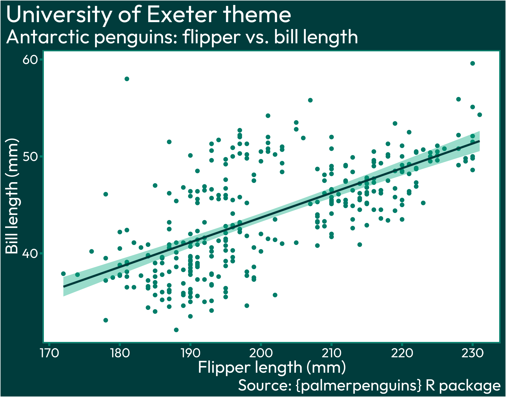
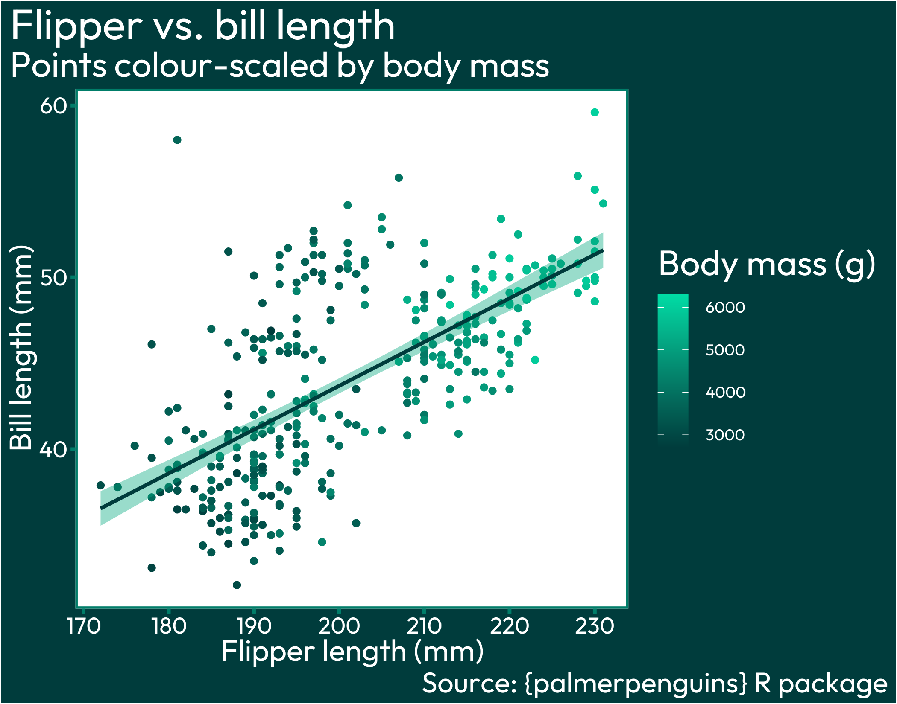
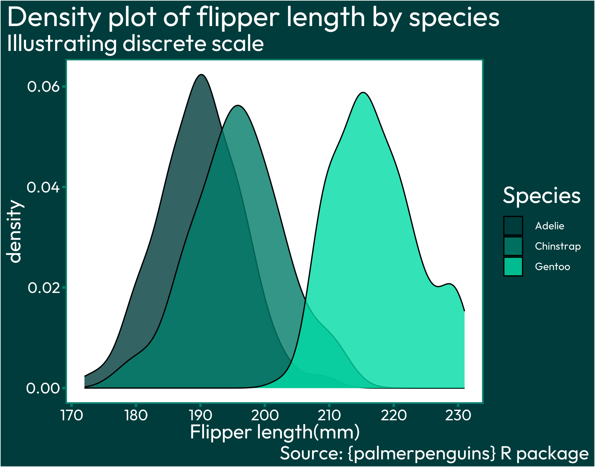
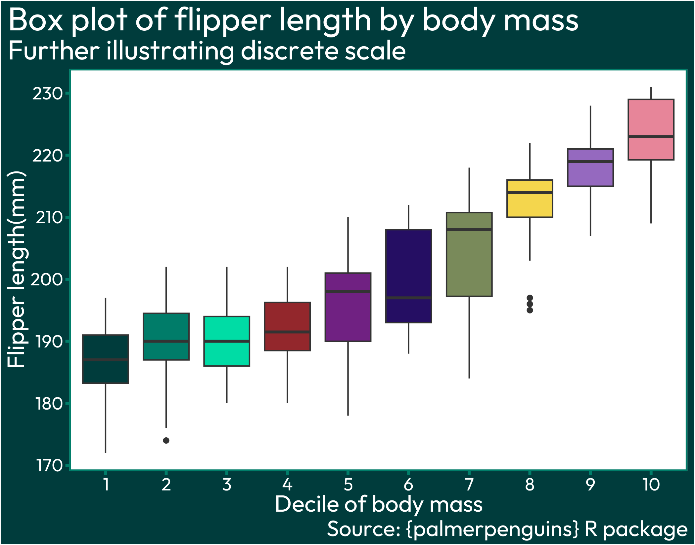

# theme_exeter
R ggplot theme matching the University of Exeter colour scheme


# Installation
Requires packages `ggplot2`, `showtext` and `sysfonts`

Source the script from GitHub (or run locally) to get access to `theme_exeter()`
``` r
source("https://raw.githubusercontent.com/lukepilling/theme_exeter/main/theme_exeter.R")
```

# Examples
What colours are in the "Exeter palette"? From: https://brand.exeter.ac.uk/colour/
``` r
exeter_palette
#>  night_green      dark_green      deep_green      rich_green    bright_green highlight_green 
#>    "#022020"       "#003C3C"       "#007D69"       "#00A87E"       "#00C896"       "#00DCA5"
```

See what colours are used where:
``` r
exeter_theme_colors
#> background       text      panel     border    lighter      light     medium       dark 
#>  "#003C3C"  "#FFFFFF"  "#FFFFFF"  "#007D69"  "#00DCA5"  "#00A87E"  "#007D69"  "#003C3C"
``` 

How to use the theme and above palettes:
``` r
ggplot(palmerpenguins::penguins, aes(x = flipper_length_mm, y = bill_length_mm)) +
  geom_point(color =  exeter_theme_colors["medium"]) +
  geom_smooth(method = 'lm',
              color = exeter_theme_colors["dark"],
              fill =  exeter_theme_colors["light"]) +
  labs(title = 'University of Exeter theme', 
       subtitle = "Antarctic penguins: flipper vs. bill length",
       caption = "Source: {palmerpenguins} R package",
       x = "Flipper length (mm)",
       y = "Bill length (mm)") +
  theme_exeter()
```


``` r
ggplot(palmerpenguins::penguins, aes(x = flipper_length_mm, y = bill_length_mm)) +
  geom_point(aes(color = body_mass_g)) +
  geom_smooth(method = 'lm',
              color = exeter_theme_colors["dark"],
              fill =  exeter_theme_colors["light"]) +
  labs(title = 'Flipper vs. bill length', 
       subtitle = "Points colour-scaled by body mass",
       caption = "Source: {palmerpenguins} R package",
       x = "Flipper length (mm)",
       y = "Bill length (mm)",
       color = "Body mass (g)") +
  theme_exeter() +
  scale_color_exeter()
```



``` r
ggplot(palmerpenguins::penguins, aes(flipper_length_mm)) +
  geom_density(aes(fill=factor(species)), alpha=0.8) +
  labs(title="Density plot of flipper length by species",
       subtitle = "Illustrating discrete scale",
       caption = "Source: {palmerpenguins} R package",
       x="Flipper length(mm)",
       fill="Species") +
  theme_exeter() +
  scale_fill_exeter_discrete()
```



``` r

palmerpenguins::penguins |> na.omit() |>
  dplyr::mutate(body_mass_g_qt = as.factor(cut(body_mass_g, breaks=quantile(body_mass_g, probs=seq(0,1,0.1)), include=T, labels=F))) |>
  ggplot(aes(x=body_mass_g_qt, y=flipper_length_mm, fill=body_mass_g_qt)) +
    geom_boxplot() +
    labs(title="Box plot of flipper length by body mass",
         subtitle = "Further illustrating discrete scale",
         caption = "Source: {palmerpenguins} R package",
         x="Decile of body mass",
         y="Flipper length(mm)") +
    theme_exeter() +
    scale_fill_exeter_discrete() +
    theme(legend.position="none")
```



